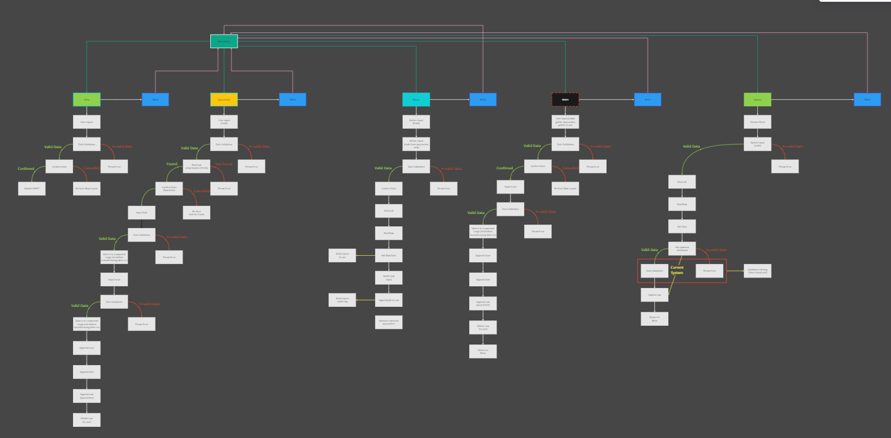
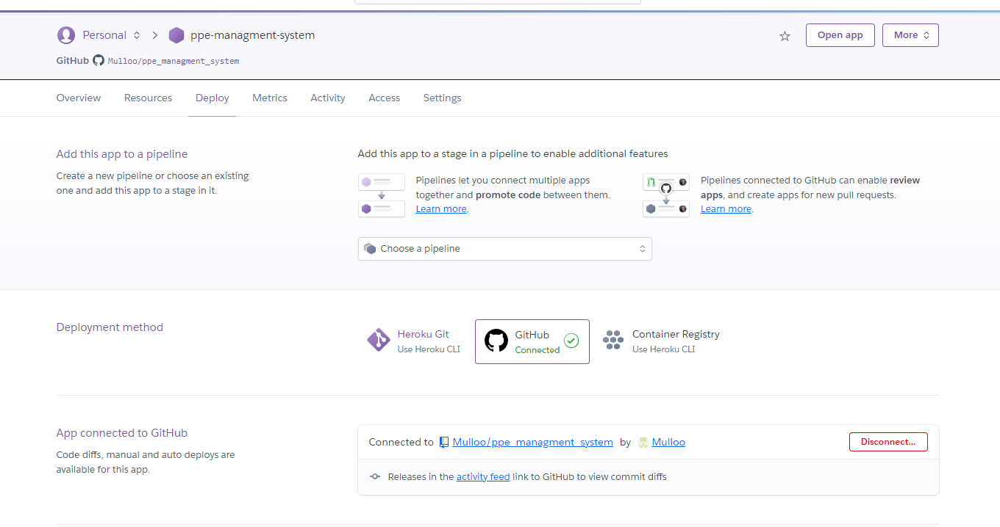
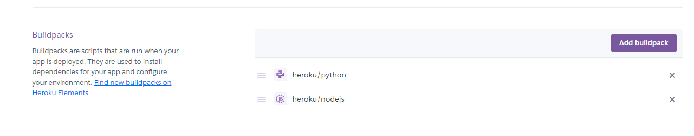
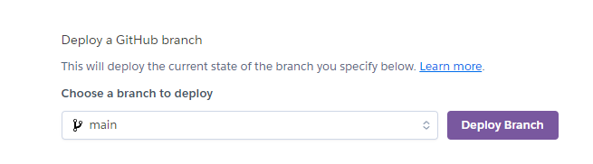
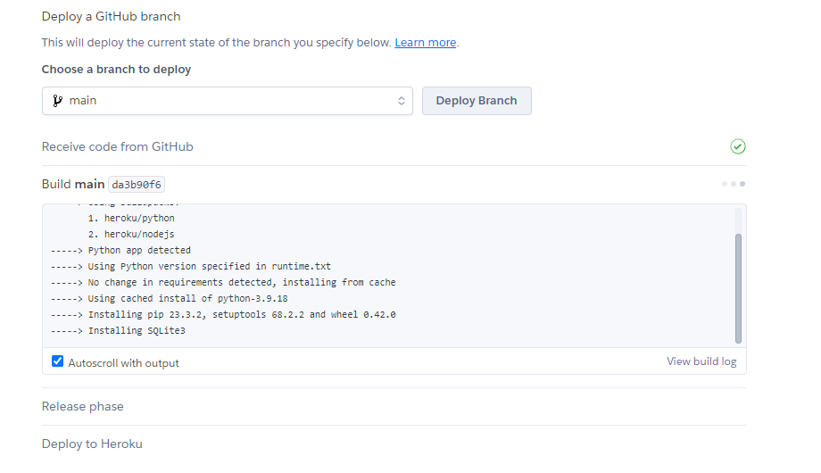
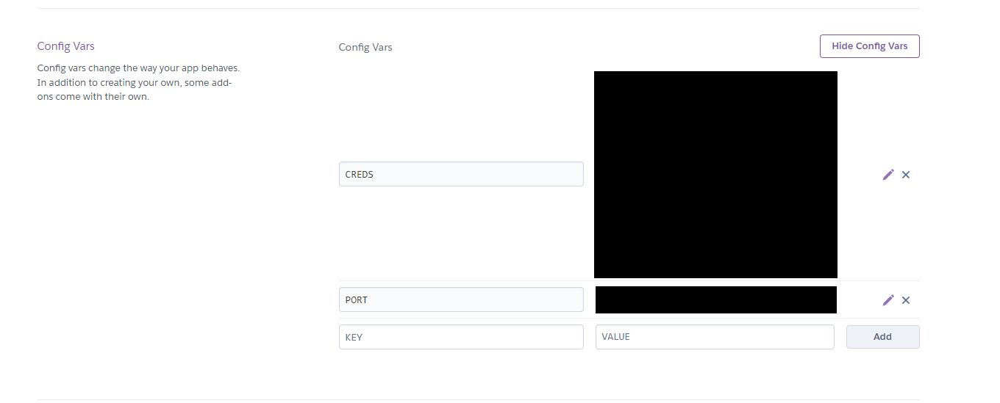
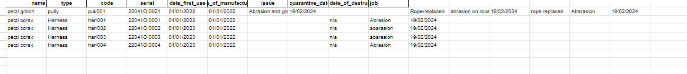
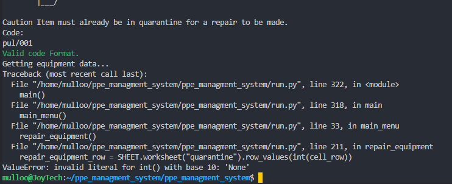
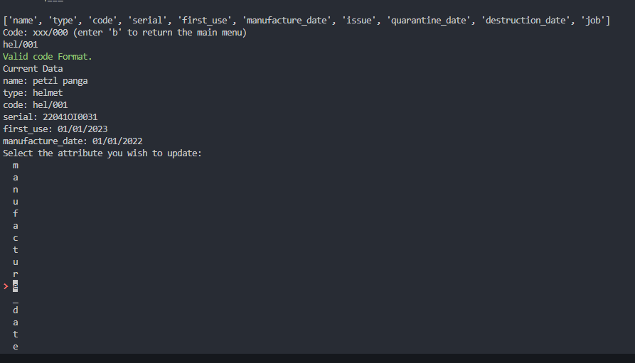

# P.E.E Management System

## Links

- [P.P.E Management System Live](https://ppe-managment-system-fbe7b98e0e3d.herokuapp.com/)
- [P.P.E Management System Repo](https://github.com/Mulloo/ppe_managment_system)
- Created by - [Daniel Mullooly](https://github.com/Mulloo)

## About

P.P.E Management System is a terminal program to organize safety equipment mostly intended for climbing equipment such as harnesses, helmets, ropes, lanyards and so on.

## User Stories

- As a safety officer, I want to import new PPE items into the system so that I can track their usage and maintenance.
- As a user, I need to quarantine defective or expired PPE to ensure they are not used accidentally.
- As a technician, I want to log repairs of PPE items to keep track of maintenance history.
- As an administrator, I need to retire PPE items that are no longer safe to use to comply with safety regulations.
- As a user, I want to view the status and history of PPE items for accountability and audit purposes.

## Technology Used

- Python: For scripting and automation.
[Python](https://www.w3schools.com/python/default.asp)
- Google Sheets API (gspread): To interact with Google Sheets for data storage and retrieval.
[Google Api](https://developers.google.com/sheets/api/guides/concepts)
- Simple Term Menu: To create interactive terminal menus.
[Simple Term Menu](https://pypi.org/project/simple-term-menu/)
- Colorama: For Error text coloring
[Colorama](https://pypi.org/project/colorama/)
- Regular Expressions: For data validation.
[Regular Expressions](https://docs.python.org/3/howto/regex.html)
- Datetime: For date validation
[Datetime](https://docs.python.org/3/library/datetime.html#available-types)
- Tabulate: Create the table in the view feature.
[Tabulate](https://pypi.org/project/tabulate/)
- Textwrap: To keep table inside the terminal window.
[Textwrap](https://docs.python.org/3/library/textwrap.html)
- Heroku: for deployment
[Heroku](https://www.heroku.com/)
- github: for repository storage
[Github](https://github.com/)
- git: for version control
[Git](https://git-scm.com/)
- miro: for flowchart
[Miro](https://miro.com/)

## Features

- Importing new PPE items into the system.
- Quarantining PPE items with issues.
- Repairing and logging maintenance activities.
- Retiring PPE items and moving them to a retired sheet.
- Viewing detailed information about PPE items.
- Terminal-based UI for quicker navigation.

## Flowchart

- Miro FlowChart

## Deployment

- Connect Repo to Heroku.

- Setup buildpack.

-Click Deploy branch.

- Click view build log to see the operation.

- Add credentials and port to config vars.

## Testing

### Manual Testing

| Feature         | Valid Input                                         | Invalid                                                  | Expected Outcome  Valid Input                                                                                                                                                         | Expected Outcome Invalid Input                                                 | Tested | Pass | Comments                                                                        |
|-----------------|-----------------------------------------------------|----------------------------------------------------------|---------------------------------------------------------------------------------------------------------------------------------------------------------------------------------------|--------------------------------------------------------------------------------|--------|------|---------------------------------------------------------------------------------|
| Import New PPE  | Full details  Correct format  All information given  | Missing details  Incorrect format Some information given | Item is added to the system                                                                                                                                                          | User is informed of the appropriate format  and prompted to input correctly    | Y      | Y    |                                                                                 |
| Quarantine  PPE | Correct ID                                          | In-Correct ID Format                                     | User is prompted with the issue input and  item is moved to quarantine                                                                                                               | User is prompted to re-enter the ID                                            | Y      | Y    |                                                                                 |
| Repair PPE      | Correct ID, Date, and job                           | Date given in the wrong format                           | The item and job are logged to the repair  The item is then moved out of quarantine and  into in use with out the job append.                                                         | User is show the correct date format and give  the chance to re-enter the date | Y      | Y    |                                                                                 |
| View PPE Sheet  | User selects a Sheet to View                        | N/A (Simple Term Menu in use)                            | The sheet is displayed to the terminal for the user to  review                                                                                                                        | N/A                                                                            | Y      | Y    | Issue with longer form sheet  No displaying correctly on 80  character terminal |
| Update          | Correct ID given                                    | Incorrect ID given                                       | The user is shown the equipment to update and prompted to select the attribute the would like to change  once selected the attribute is update and the new data is  sent to the sheet | User is prompted to re-enter the code                                          | Y      | Y    | Validation on the new data is missing  Due to time constraint                   |
| Back            | N/A                                                 | N/A                                                      | If the user wishes to return at certain points to the main menu there is either a menu option or a text input option.                                                                 | N/A                                                                            | Y      | Y    |                                                                                 |

### Bugs

- The cause of the bug is not known. This bug was able to be replicated and mitigated but still unsure as to why the data was being sent to the wrong area of the spreadsheet, Solved by reformating the sheet manually and testing data placement.

- The Cell row variable would return this when the int(cell_row) was first added usually caused by an incorrect variable or variable type

f

- Simple term menu printing the last list attribute vertically, Solved by getting user input in replace of term menu.

### Validation

- 126: E501 line too long (104 > 79 characters)
- 140: E501 line too long (85 > 79 characters)
- 149: W605 invalid escape sequence '\m'
- 149: W605 invalid escape sequence '\y'
- 163: E501 line too long (87 > 79 characters)
- 172: W605 invalid escape sequence '\m'
- 172: W605 invalid escape sequence '\y'
- 202: E501 line too long (86 > 79 characters)
- 238: E501 line too long (83 > 79 characters)
- 247: W605 invalid escape sequence '\m'
- 247: W605 invalid escape sequence '\y'
- 279: E501 line too long (83 > 79 characters)
- 309: E501 line too long (82 > 79 characters)
- 467: E501 line too long (138 > 79 characters)
- 475: E501 line too long (80 > 79 characters)
- 487: E501 line too long (80 > 79 characters)
- 501: E501 line too long (84 > 79 characters)
- 510: E501 line too long (85 > 79 characters)
- 519: W605 invalid escape sequence '\m'
- 519: W605 invalid escape sequence '\y'
- 531: E501 line too long (83 > 79 characters)
- 533: E501 line too long (94 > 79 characters)

## Citation

Implementation of some of the library's and third-party modals was discovered on StackOverflow no code was taken directly.
