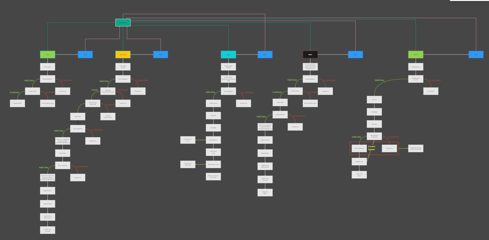
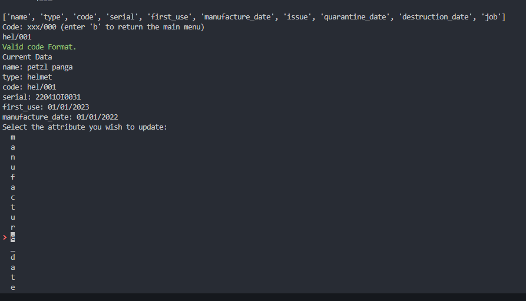
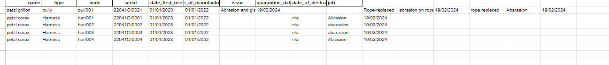

# P.E.E Management System

## Links

- [P.P.E Management System Live](https://ppe-managment-system-fbe7b98e0e3d.herokuapp.com/)
- [P.P.E Management System Repo](https://github.com/Mulloo/ppe_managment_system)
- Created by - [Daniel Mullooly](https://github.com/Mulloo)

## About

P.P.E Management System is a terminal program to organize safety equipment mostly intended for climbing equipment such as harnesses, helmets, ropes, lanyards and so on.

## User Stories

## Technology Used

## Features

## Logic template

[Miro FlowChart]("https://miro.com/app/board/uXjVN8ulxCg=/?share_link_id=908951638780")

## Testing

### Manual Testing

| Feature                  | Scenario                                              | Valid Input               | Invalid Input          | Expected Outcome with Valid Input         | Expected Outcome with Invalid Input       |
|--------------------------|-------------------------------------------------------|---------------------------|---------------------------|-------------------------------------------|-------------------------------------------|
| Importing New PPE Items  | A safety officer imports a new PPE item               | Complete PPE details      | Missing item category  | Item added to the system                 | Prompt for missing information            |
| Quarantining PPE Items   | An item is identified as defective                    | Correct item ID           | Non-existent ID        | Item moved to quarantine list             | Error message shown for invalid IDs       |
| Repairing PPE Items      | Logging a repair activity for a PPE item              | Repair details with date  | Future date            | Repair logged with valid details          | Error prompts for invalid date inputs     |
| Retiring PPE Items       | Retiring a PPE item that's no longer safe             | Item ID of PPE to retire  | ID for non-existent item| Item correctly retired                    | Error message for invalid IDs             |
| Viewing PPE Sheets | Viewing detailed information about a PPE item         | Existing item ID          | ID for an unknown item | Detailed information displayed            | Error message for invalid IDs             |
| Validation Across Features| The system checks inputs across most features         | Expected format inputs    | Out-of-range inputs    | System accepts and processes inputs       | System rejects inputs with feedback       |

### Bugs

### Validation

### Lighthouse

## Credits

## Acknowledgments
